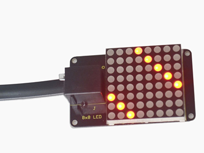

# KS0157 keyestudio EASY plug learning kit for Arduino super makers


**● EASY plug starter kit for Arduino**

**● Based on open-source hardware**

**● 19 various sensors in one box**

**● For you to make interesting projects**

## 1.Summary:

What about you and your kids being makers? What about getting creative and making your ideas come true? Well, let's get started right away!

EASY plug learning kit is developed not only for professional electronic enthusiasts, but also for friends in other lines of work. Even if you have no electronics related knowledge, you can use it to realize your ideas as long as you want to.

The tutorial of this kit has fully considered the learning interest of beginners. Starting from the basics to more complex lessons, well-arranged content and a connection diagram for every lesson help you get started easily and quickly in learning Arduino.

Its unique EASY plug interface makes the wire connection easier than ever! You never have to worry about wrong connection or complicated soldering, avoiding component damage due to wrong wiring or wrong soldering. It's both safe and environmental-friendly.

## 2.Kit list

| No.  | Name                                             | QTY  | Picture                                   |
| ---- | ------------------------------------------------ | ---- | ----------------------------------------- |
| 1    | EASY plug controller Board                       | 1    |                   |
| 2    | Acrylic Board + Copper bush set                  | 1    |     |
| 3    | EASY plug cable                                  | 3    |                   |
| 4    | USB cable                                        | 1    |                   |
| 5    | EASY plug Piranha LED Module                     | 3    |                   |
| 6    | EASY plug Line Tracking Sensor                   | 1    |                   |
| 7    | EASY plug Infrared obstacle avoidance sensor     | 1    |                   |
| 8    | EASY plug Photo Interrupter Module               | 1    |                   |
| 9    | EASY plug PIR Motion Sensor                      | 1    |                   |
| 10   | EASY plug DS18B20 Temperature Sensor             | 1    |                  |
| 11   | EASY plug IR Receiver Module                     | 1    |                  |
| 12   | EASY plug IR Transmitter Module                  | 1    |                  |
| 13   | EASY plug Single Relay Module                    | 1    |                  |
| 14   | EASY plug ADXL345 Three Axis Acceleration Module | 1    |                  |
| 15   | EASY plug DHT11 Temperature and Humidity Sensor  | 1    |                  |
| 16   | EASY plug DS3231 Clock Module                    | 1    |                  |
| 17   | EASY plug Analog Gas Sensor                      | 1    |                  |
| 18   | EASY plug Analog Alcohol Sensor                  | 1    |                  |
| 19   | EASY plug MQ135 Air Quality Sensor               | 1    |                  |
| 20   | EASY plug BMP180 Barometric Pressure Sensor      | 1    |                  |
| 21   | EASY plug Bluetooth Module                       | 1    |                  |
| 22   | EASY plug 1602 I2C Module                        | 1    |                  |
| 23   | EASY plug I2C 8x8 LED Matrix                     | 1    |  |

## 3.Lesson list

1\. Who's blinking

2\. Flowing light

3\. My LCD display

4\. Running light

5\. Control electricity

6\. Black or white

7\. Is there something upfront

8\. Is the light blocked

9\. It’s moving

10\. Make a clock

11\. What’s the air pressure

12\. Bluetooth so easy

13\. I receive a signal

14\. Transmit a signal

15\. How’s the air quality

16\. Is there a gas leakage

17\. Did he drink

18\. Somebody is in this area

19\. What’s the temperature

20\. How humid & hot is the air

## 4.Lesson details:

Lesson 1: Who's blinking

**Introduction**

As the first lesson of this kit, we will begin with something simple. In this lesson, all you need to do is to connect an LED to one of the digital pins of main board. With the program we provided here, you can easily control the blinking of an LED.

**Hardware required**

1. EASY plug controller Board \*1
2. EASY plug cable \*1
3. USB cable \*1
4. EASY plug Piranha LED Module \*1

First, let’s take a look at this Piranha LED Module.


This is a special LED module. When you connect it to ARDUINO, after program, it can emit beautiful light. Of course, you can also control it using PWM. It will be like fireflies at night. Isn’t it cool? We can also combine it with other sensors to do various interesting interactive experiments. 
Below are its specifications:

1. Module type: digital
2. Working voltage: 5V
3. Distance between pins: 2.54mm
4. Size: 33.7\*20mm
5. Weight: 3g

**Connection Diagram**

Now, let’s connect this module to the D11 port of the controller board using the EASY plug cable, just as simple as that!


**Sample Code**

Connect the board to your PC using the USB cable; copy below code into Arduino IDE, and click upload to upload it to your board.

```c++
int ledPin = 11; // define digital pin 11
void setup()
{
pinMode(ledPin, OUTPUT);// define LED pin as output
}
void loop()
{
analogWrite(ledPin,255); //set the LED on, regulate light brightness, ranging from
0-255, 255 is the brightest
delay(1000); // wait for a second
digitalWrite(ledPin, LOW); // set the LED off
delay(1000); // wait for a second
}
```

**Result**

The LED will be on for one second, and then off for one second with an interval of one second, just like a shining eye blinking.


Lesson 2: Flowing light

**Introduction**

LED can do many things. I believe you have seen billboards with lights changing to form various patterns. Now, you can make one! This lesson is called Flowing light. We will need 2 more EASY plug cables and 2 more LEDs than the previous lesson.

**Hardware required**

1. EASY plug controller Board \*1
2. EASY plug cable \*3
3. USB cable \*1
4. EASY plug Piranha LED Module \*3

**Connection Diagram**

Now, connect the LED modules one by one to D9, D10 and D11 ports of the controller board using the EASY plug cables.


**Sample Code**

Connect the board to your PC using the USB cable; copy below code into Arduino IDE, and click upload to upload it to your board.


```c++
int BASE = 9 ;// the I/O pin for the first LED
int NUM = 3;//number of LEDs
void setup()
{
    for (int i = BASE; i < BASE + NUM; i ++)
    {
        pinMode(i, OUTPUT);// set I/O pins as output
    }
}

void loop()
{
    for (int i = BASE; i < BASE + NUM; i ++)
    {
        digitalWrite(i, HIGH);//set I/O pins as “high”, turn on LEDs one by one
        delay(200);// wait 0.2S
    }
    for (int i = BASE; i < BASE + NUM; i ++)
    {
        digitalWrite(i, LOW);// set I/O pins as “low”, turn off LEDs one by one
        delay(200);// wait 0.2S
    }
}
```


**Result**

3 LEDs turn on one by one, and then turn off one by one, just like flowing light.


Lesson 3: My LCD display

LCDs are very common and useful in our life. It’s widely applied on phone screens and TV screens. In this lesson, we will introduce you a 1602 LCD module to help you understand how it works.

**Hardware required**  

1. EASY plug controller Board x1  
2. USB cable x1  
3. EASY plug cable x1  
4. EASY plug 1602 I2C Module x1

First, let’s take a look at this 1602 I2C Module.


EASY plug 1602 I2C module is a 16 character by 2 line LCD display with blue background and white backlight. This LCD is ready-to-use because it is compatible with the Arduino Liquid Crystal Library. The original 1602 LCD needs 7 IO ports to be up and running, this easy plug design makes the wire connection easier than ever. 
Below are its specifications:

1. I2C Address: 0x27
2. Back lit (Blue with white char color)
3. Supply voltage: 5V
4. Adjustable contrast
5. Size: 98\*36mm
6. Weight: 4g

**Connection Diagram**

Now, connect the LCD module to the IIC port of the controller board using the EASY plug cable.


**Sample Code**

Connect the board to your PC using the USB cable; copy below code into Arduino IDE, and click upload to upload it to your board.

```c++
//Compatible with the Arduino IDE 1.0
//Library version:1.1
#include <Wire.h>    // Place file “Wire.h” under the directory “library” of Arduino
#include <LiquidCrystal_I2C.h>  // Place file “LiquidCrystal_I2C.h” under the directory “library” of Arduino
LiquidCrystal_I2C lcd(0x27,16,2);  // set the LCD address to 0x27 for a 16 chars and 2 line display
void setup()
{
  lcd.init();                      // initialize the lcd 
  lcd.init();
  // Print a message to the LCD.
  lcd.backlight();
  lcd.setCursor(2,0);
  lcd.print("Hello, world!");
  lcd.setCursor(2,1);
  lcd.print("Hello, keyes!");
}
void loop()
{
}
```


**Result**

After power is on, the first line of LCD will display “Hello, world!”, and the second line will display “Hello, keyes!”.

  

Lesson 4: Running light

Walking down a business street a night, you must be amazed by all the beautiful lights around you. In this lesson, we will make one of our own and learn how those beautiful lights are achieved.

**Hardware required**

1. EASY plug controller Board x1
2. USB cable x1
3. EASY plug cable x1
4. EASY plug I2C 8x8 LED Matrix x1

Let’s first meet this EASY plug I2C 8x8 LED Matrix.


What's better than a single LED? Lots of LEDs! A fun way to make a small display is to use an 8x8 matrix. This matrix uses a driver chip that does all the heavy lifting for you: They have a built in clock so they multiplex the display. They use constant-current drivers for ultra-bright, consistent color, 1/16 step display dimming, all via a simple I2C interface. 
Below are its specifications:

1. Supply voltage: 4.5V-5.5V
2. Maximum display: 16\*8
3. Size: 53\*32mm
4. Weight: 4g

**Connection Diagram**

Now, connect the module to the IIC port of the controller board using the EASY plug cable.


**Sample Code**

Connect the board to your PC using the USB cable; copy below code into Arduino IDE, and click upload to upload it to your board.

```c++
#include <Wire.h>  // Place file “Wire.h” under the directory “library” of Arduino
#include "Adafruit_LEDBackpack.h" // Place file “Adafruit_LEDBackpack.h” under the directory “library” of Arduino
#include "Adafruit_GFX.h"  // Place file “Adafruit_GFX.h” under the directory “library” of Arduino
#define _BV(bit) (1<<(bit))
#endif
Adafruit_LEDBackpack matrix = Adafruit_LEDBackpack();
uint8_t counter = 0;
void setup() {
    Serial.begin(9600);
    Serial.println("HT16K33 test"); 
    matrix.begin(0x70);  // pass in the address
}
void loop() {
    // paint one LED per row. The HT16K33 internal memory looks like
    // a 8x16 bit matrix (8 rows, 16 columns)
    for (uint8_t i=0; i<8; i++) {
        // draw a diagonal row of pixels
        matrix.displaybuffer[i] = _BV((counter+i) % 16) | _BV((counter+i+8) % 16)  ;
    }
    // write the changes we just made to the display
    matrix.writeDisplay();
        delay(100);

    counter++;
    if (counter >= 16) counter = 0;  
}
```

**Result**

After all the above are done (circuit connection, program uploading), press the “reset” button on the main board. The LED matrix begins to display a beautiful light pattern, as pictures show below.




Lesson 5: Control electricity

In this lesson, we will learn to use a very important element in the switch family. It’s called relay. Relay is specially used in controlling a high-power circuit by a low-power signal. Here, we will only do a simple module test due to limited resources while you can expend the circuit and the program to have more fun with it.

**Hardware required**

1. EASY plug controller Board x1
2. USB cable x1
3. EASY plug cable x1
4. EASY plug Single Relay Module x1

Next is a brief introduction of this relay module.


Relay is an automatic switch element with isolation function. It's widely used in remote control, remote sensing, communication, automatic control, mechatronics and electronic devices. It is one of the most important control elements. Besides, it’s easy to control and use just by inputting different level signals to corresponding ports of the relay. The single relay we introduced here has a status indicator light, convenient for you to observe the on and off status of the relay. 
Below are its specifications:
1. Type: Digital
2. Rated current: 10A (NO) 5A (NC)
3. Maximum switching voltage: 150VAC 24VDC

Digital interface
1. Control signal: TTL level
2. Rated load: 8A 150VAC (NO) 10A 24VDC (NO), 5A 250VAC (NO/NC) 5A 24VDC (NO/NC)
3. Maximum switching power: AC1200VA DC240W (NO) AC625VA DC120W (NC)
4. Contact action time: 10ms
5. Size: 46.5\*28mm
6. Weight: 15g

**Connection Diagram**

Now, let’s connect this module to the D8 port of the controller board using the EASY plug cable.


**Sample Code**

Connect the board to your PC using the USB cable; copy below code into Arduino IDE, and click upload to upload it to your board.

```c++
int Relay = 8;
void setup()
{
    pinMode(Relay, OUTPUT);     //Set Pin3 as output
}
void loop()
{
    digitalWrite(Relay, HIGH);   //Turn on relay
    delay(1000);
    digitalWrite(Relay, LOW);   //Turn on relay
    delay(1000);                
}
```


**Result**

After all the above are done, you can hear the relay module is ticking, and the LED on the module is being on for 1S (“ON” contacts are connected), and off for 1S (“ON” contacts are connected).


Lesson 6: Black or white

Have you seen a line tracking smart car? That is a car going along a line with specific color. In this lesson, we will learn how to achieve such result. Here, we will use a Line Tracking Sensor and a Piranha LED Module to help you better understand how it works.

**Hardware required**  
1. EASY plug controller Board x1  
2. USB cable x1  
3. EASY plug cable x2  
4. EASY plug Piranha LED Module x1  
5. EASY plug Line Tracking Sensor x1

First, we will learn something about this Line Tracking Sensor.


This Line Tracking Sensor can detect white line in black and black line in white. The single line-tracking signal provides a stable output signal TTL for a more accurate and more stable line. Multi-channel option can be easily achieved by installing required number of line-tracking sensors.

The working principle is simple, using infrared light's different reflectivity of different color, and converting the strength of the reflected signal into current signal.

Below are its specifications:
1. Power supply: +5V
2. Operating current: < 10mA
3. Operating temperature range: 0°C \~ + 50°C
4. Output interface: 3-wire interface (1 - signal, 2 - power, 3 - power supply negative)
5. Output Level: TTL level
6. Size: 56.8\*16mm
7. Weight: 3g

**Connection Diagram**

Now, connect the LED module to the D10 port of the controller board, and line tracking sensor module to D3 port using the EASY plug cables.


**Sample Code**

Connect the board to your PC using the USB cable; copy below code into Arduino IDE, and click upload to upload it to your board.

```c++
#define Sensor 3
#define ledpin 10
void setup()
{
  pinMode(Sensor,INPUT);
  pinMode(ledpin,OUTPUT);
  Serial.begin(9600);
}
void loop()
{
  int val =digitalRead(Sensor);
  digitalWrite(ledpin,val);
  Serial.println(val); // print the data from the sensor   
  delay(200);
}
```


**Result**

After power is on, open serial monitor, you can see the current value is 1, the LED on the module remains off and the Piranha LED is on. When you place a white card in front of the sensor, you can see the LED on the module turns on, the value changes to 0 and the Piranha LED turns off. Now, place a black card in front of the sensor, you can see the result is the same with when there is nothing in front of the sensor. This principle is applied to line tracking smart car by programming the result.

Lesson 7: Is there something upfront

If you are interested in smart cars, you might be intrigued in how they avoid obstacles. It’s not like the smart cars have eyes, right? In this lesson, we will learn how to use a infrared obstacle avoidance sensor. This sensor is widely applied in obstacle avoidance, fall prevention of smart cars, product counting etc. After this lesson, you will know how obstacle avoidance function of smart cars can be achieved.

**Hardware required**  
1. EASY plug controller Board x1  
2. USB cable x1  
3. EASY plug cable x2  
4. EASY plug Piranha LED Module x1  
5. EASY plug Infrared obstacle avoidance sensor x1

Below is a brief introduction of this infrared obstacle avoidance sensor.


Infrared obstacle avoidance sensor is equipped with distance adjustment function and is especially designed for wheeled robots. This sensor has strong adaptability to ambient light and is of high precision. It has a pair of infrared transmitting and receiving tube. When infrared ray launched by the transmitting tube encounters an obstacle (its reflector), the infrared ray is reflected to the receiving tube, and the indicator will light up. A robot mounted with the sensor can sense changes in the environment. 
Below are its specifications:

1. Working voltage: DC 3.3V-5V
2. Working current: ≥20mA
3. Working temperature: －10℃—＋50℃
4. Detection distance: 2-1000px
5. IO Interface: 4 wire interface (-/+/S/EN)
6. Output signal: TTL voltage
7. Accommodation mode: Multi-circle resistance regulation
8. Effective Angle: 35°
9. Size: 51\*16.5mm
10. Weight: 5g

**Connection Diagram**

Now, connect the LED module to the D10 port of the controller board and obstacle avoidance sensor to D3 port using the EASY plug cables.


**Sample Code**

Connect the board to your PC using the USB cable; copy below code into Arduino IDE, and click upload to upload it to your board.

```c++
const int sensorPin = 3;     // the number of the sensor pin
const int ledPin =  10;      // the number of the LED pin
int sensorState = 0;         // variable for reading the sensor status
void setup() {
  pinMode(ledPin, OUTPUT);      
  pinMode(sensorPin, INPUT); }
void loop(){
  // read the state of the sensor value:
  sensorState = digitalRead(sensorPin);
  // if it is, the sensorState is HIGH:
  if (sensorState == HIGH) {     
     digitalWrite(ledPin, HIGH);  
  } 
  else {
       digitalWrite(ledPin, LOW); 
  }
}
```

**Result**   

When power is on, use a screw driver to adjust the two knobs on the module. P LED is always on and S LED is out. At this time, the piranha LED is on. Now, put your hand in front of the sensor, you can see the S LED front of the sensor turns on and the piranha LED is out. If you open the serial monitor, you can see when it detects an object, the output is “0”; no object, output is “1”. These different outputs can be used as a switch signal to control smart car actions and that’s how smart cars realize obstacle avoidance function.


Lesson 8: Is the light blocked

If you have seen a production line, you must be wondering how the machines do the workpiece counting. Well, in this lesson, we will show you how this technology is achieved.

**Hardware required**

1. EASY plug controller Board x1
2. USB cable x1
3. EASY plug cable x2
4. EASY plug Piranha LED Module x1
5. EASY plug Photo Interrupter Module x1

In realizing the counting process, below is a critical part called Photo Interrupter Module.


Upright part of this sensor is an infrared emitter and on the other side, it’s a shielded infrared detector. By emitting a beam of infrared light from one end to another end, the sensor can detect an object when it passes through the beam. It is used for many applications including optical limit switches, pellet dispensing, general object detection, etc. 
Below are its specifications:

1. Supply Voltage: 3.3V to 5V
2. Interface: Digital
3. Size: 38x20mm
4. Weight: \*g

**Connection Diagram**

Now, connect the LED module to the D10 port of the controller board and Photo Interrupter Module to D3 port using the EASY plug cables.


**Sample Code**

Connect the board to your PC using the USB cable; copy below code into Arduino IDE, and click upload to upload it to your board.
```c++
// photo interrupter module

int Led = 10 ;// define LED Interface
int buttonpin = 3; // define the photo interrupter sensor interface
int val ;// define numeric variables val
void setup ()
{
    pinMode (Led, OUTPUT) ;// define LED as output interface
    pinMode (buttonpin, INPUT) ;// define the photo interrupter sensor output interface   
}
void loop ()
{
    val = digitalRead (buttonpin) ;// digital interface will be assigned a value of 3 to read val
    if (val == HIGH) // When the light sensor detects a signal is interrupted, LED flashes
    {
        digitalWrite (Led, HIGH);
    }
    else
    {
        digitalWrite (Led, LOW);
    }
}
```

**Result**

After the above are done, the LED on the module will be on and the piranha LED will be off; place a paper card between the two ends of the module, you can see the LED on the module is off, and the piranha will be on. Now, you have a clear idea of how piece counting is done.


Lesson 9: It’s moving

In this lesson, we will learn how to measure the static acceleration of an object in its X, Y and Z direction using an ADXL345 three axis acceleration module. This module is also suitable for measuring dynamic acceleration.

**Hardware required**

1. EASY plug controller Board x1
2. USB cable x1
3. EASY plug cable x1
4. EASY plug ADXL345 Three Axis Acceleration Module x1
5. Below is a brief introduction of this module.


The ADXL345 module is a 3-axis MEMS accelerometer with low power consumption and compact design. It’s of high resolution of 13-bit, measurement up to ±16g(gravitational force). Digital output data is formatted as 16-bit twos complement and is accessible through either a SPI (3- or 4-wire) or I2C digital interface. 
Below are its specifications:
1. 2.0-3.6VDC Supply Voltage
2. Ultra Low Power: 40uA in measurement mode, 0.1uA in standby@ 2.5V
3. Tap/Double Tap Detection
4. Free-Fall Detection
5. SPI and I2C interfaces
6. Size: 40\*20mm
7. Weight: 3g

**Connection Diagram**

Now, let’s connect this module to the IIC port of the controller board using the EASY plug cable.


**Sample Code**

Connect the board to your PC using the USB cable; copy below code into Arduino IDE, and click upload to upload it to your board.

```c++
#include <Wire.h>    // place file “Wire.h” under the directory “libraries” of Arduino
// Registers for ADXL345
#define ADXL345_ADDRESS (0xA6 >> 1)  // address for device is 8 bit but shift to the
                                        // right by 1 bit to make it 7 bit because the
                                        // wire library only takes in 7 bit addresses
#define ADXL345_REGISTER_XLSB (0x32)

int accelerometer_data[3];
// void because this only tells the cip to send data to its output register
// writes data to the slave's buffer
void i2c_write(int address, byte reg, byte data) {
    // Send output register address
    Wire.beginTransmission(address);
    // Connect to device
    Wire.write(reg);
    // Send data
    Wire.write(data); //low byte
    Wire.endTransmission();
}

// void because using pointers
// microcontroller reads data from the sensor's input register
void i2c_read(int address, byte reg, int count, byte* data) {
    // Used to read the number of data received
    int i = 0;
    // Send input register address
    Wire.beginTransmission(address);
    // Connect to device
    Wire.write(reg);
    Wire.endTransmission();
    
    // Connect to device
    Wire.beginTransmission(address);
    // Request data from slave
    // Count stands for number of bytes to request
    Wire.requestFrom(address, count);
    while(Wire.available()) // slave may send less than requested
    {
    char c = Wire.read(); // receive a byte as character
    data[i] = c;
    i++;
    }
    Wire.endTransmission();
}

void init_adxl345() {
    byte data = 0;
    
    i2c_write(ADXL345_ADDRESS, 0x31, 0x0B);   // 13-bit mode  +_ 16g
    i2c_write(ADXL345_ADDRESS, 0x2D, 0x08);   // Power register
    
    i2c_write(ADXL345_ADDRESS, 0x1E, 0x00);   // x
    i2c_write(ADXL345_ADDRESS, 0x1F, 0x00);   // Y
    i2c_write(ADXL345_ADDRESS, 0x20, 0x05);   // Z
    
    // Check to see if it worked!
    i2c_read(ADXL345_ADDRESS, 0X00, 1, &data);
    if(data==0xE5)
    Serial.println("it work Success");
    else
    Serial.println("it work Fail");
}

void read_adxl345() {
    byte bytes[6];
    memset(bytes,0,6);
    
    // Read 6 bytes from the ADXL345
    i2c_read(ADXL345_ADDRESS, ADXL345_REGISTER_XLSB, 6, bytes);
    // Unpack data
    for (int i=0;i<3;++i) {
    accelerometer_data[i] = (int)bytes[2*i] + (((int)bytes[2*i + 1]) << 8);
    }
}

// initialise and start everything
void setup() {
    Wire.begin();
    Serial.begin(9600);
    for(int i=0; i<3; ++i) {
    accelerometer_data[i]  = 0;
    }
    init_adxl345();
}
void loop() {
    read_adxl345();
    Serial.print("ACCEL: ");
    Serial.print(float(accelerometer_data[0])*3.9/1000);//3.9mg/LSB scale factor in 13-bit mode
    Serial.print("\t");
    Serial.print(float(accelerometer_data[1])*3.9/1000);
    Serial.print("\t");
    Serial.print(float(accelerometer_data[2])*3.9/1000);
    Serial.print("\n");
    delay(100);
}
```


**Result**

Now, open serial monitor, you can see it displays data as pic 1; when you move the module towards different direction, you can see the data changes as pic 2.

Pic 1:


Pic 2:


Lesson 10: Make a clock

Time is of essence in our life. We have all sort of stuff that tells time. In this lesson, we will make a device of our own using the DS3231 clock module.
Combine with a buzzer, you can make an alarm or just a time telling device when combined with an LCD.

**Hardware required**  
1. EASY plug controller Board x1  
2. USB cable x1  
3. EASY plug cable x1  
4. EASY plug DS3231 Clock Module x1


The DS3231 is a low-cost, extremely accurate I2C real-time clock (RTC) with an integrated temperature-compensated crystal oscillator (TCXO) and crystal. The device incorporates a battery input, and maintains accurate timekeeping when main power to the device is interrupted. The integration of the crystal resonator enhances the long-term accuracy of the device as well as reduces the piece-part count in a manufacturing line. The DS3231 is available in commercial and industrial temperature ranges, and is offered in a 16-pin, 300-mil SO package. 
Below are its specifications:

1. Temperature range: -40 to +85; Timing accuracy : ± 5ppm (±0.432 seconds / day)
2. Device package and function compatible with DS3231
3. Two calendar clock
4. Output: 1Hz and 32.768kHz
5. Reset output and Input Debounce of Pushbutton
6. High speed (400kHz), I2C serial bus
7. Supply voltage: +3.3V to +5.5V
8. Digital temperature sensor with a precision of±3℃
9. Working temperature: -40 \~ ℃ to +85 \~ ℃
10. 16 pins Small Outline Package (300mil)
11. Certified by American Association of Underwriters Laboratories (UL)
12. Size: 38\*20mm
13. Weight: 4g

**Connection Diagram**

Now, connect the DS3231 module to the IIC port of the controller board using the EASY plug cable.


**Sample Code**

Connect the board to your PC using the USB cable; copy below code into Arduino IDE, and click upload to upload it to your board.

```c++
#include <Wire.h>   // place file “Wire.h” under the directory “libraries” of Arduino
#include "DS3231.h"  // place file “DS3231.h” under the directory “libraries” of Arduino
DS3231 RTC; //Create the DS3231 object
char weekDay[][4] = {"Sun", "Mon", "Tue", "Wed", "Thu", "Fri", "Sat" };
//year, month, date, hour, min, sec and week-day(starts from 0 and goes to 6)
//writing any non-existent time-data may interfere with normal operation of the RTC.
//Take care of week-day also.
DateTime dt(2015, 12, 16, 10,25, 33, 3);//open the series port and you can check time here or make a change to the time as needed.
void setup () 
{   Serial.begin(57600);//set baud rate to 57600
    Wire.begin();
    RTC.begin();
    RTC.adjust(dt); //Adjust date-time as defined 'dt' above 
}
void loop () 
{   DateTime now = RTC.now(); //get the current date-time
    Serial.print(now.year(), DEC);
    Serial.print('/');
    Serial.print(now.month(), DEC);
    Serial.print('/');
    Serial.print(now.date(), DEC);
    Serial.print(' ');
    Serial.print(now.hour(), DEC);
    Serial.print(':');
    Serial.print(now.minute(), DEC);
    Serial.print(':');
    Serial.print(now.second(), DEC);
    Serial.println();
    Serial.print(weekDay[now.dayOfWeek()]);
    Serial.println();
    delay(1000);
}
```

**Result**

Now, open serial monitor, set baud rate to 57600, it will display the date we set in the program. You can change the code for it to display different dates; the module will then begin time counting, as below picture shows.


Lesson 11: What’s the air pressure

In this lesson, we will measure the Temperature, Pressure, Standard Atmosphere and Altitude using a BMP180 Barometric Pressure Sensor. You can also apply the experiment principle to make a vertical velocity indicator, a device that can regulate fan power etc.

**Hardware required**

1. EASY plug controller Board x1
2. USB cable x1
3. EASY plug cable x1
4. EASY plug BMP180 Barometric Pressure Sensor x1

We will briefly take a look at this BMP180 first.


BMP180 is a pressure sensor with high precision, compact design and low power consumption. It can be used in mobile devices. Minimum absolute accuracy reaches 0.03hpa with only 3uA power consumption. 
Below are its specifications:

1. Pressure range: 300\~1100hPa (Altitude 9000M\~-500M)
2. Supply voltage: 1.8V\~3.6V (VDDA), 1.62V\~3.6V(VDDD)
3. Low power consumption: 0.5uA, standard mode
4. I2C interface
5. With temperature output
6. Leadless, comply with RoHS
7. MSL 1 response time: 7.5ms
8. Standby current: 0.1uA
9. No need for external clock circuit
10. Size: 35\*20mm
11. Weight: 6g

**Connection Diagram**

Now, connect the BMP180 module to the IIC port of the controller board using the EASY plug cable.


**Sample Code**

Connect the board to your PC using the USB cable; copy below code into Arduino IDE, and click upload to upload it to your board.

```c++
#include <Wire.h>  // place file “Wire.h” under the directory “library” of Arduino
#define BMP085_ADDRESS 0x77  // I2C address of BMP085
const unsigned char OSS = 0;  // Oversampling Setting
// Calibration values
int ac1;
int ac2;
int ac3;
unsigned int ac4;
unsigned int ac5;
unsigned int ac6;
int b1;
int b2;
int mb;
int mc;
int md;
// b5 is calculated in bmp085GetTemperature(...), this variable is also used in bmp085GetPressure(...)
// so ...Temperature(...) must be called before ...Pressure(...).
long b5; 
void setup(){
    Serial.begin(9600);
    Wire.begin();
    bmp085Calibration();
}

void loop()
{
    float temperature = bmp085GetTemperature(bmp085ReadUT()); //MUST be called first
    float pressure = bmp085GetPressure(bmp085ReadUP());
    float atm = pressure / 101325; // "standard atmosphere"
    float altitude = calcAltitude(pressure); //Uncompensated caculation - in Meters 
    Serial.print("Temperature: ");
    Serial.print(temperature, 2); //display 2 decimal places
    Serial.println("deg C");
    Serial.print("Pressure: ");
    Serial.print(pressure, 0); //whole number only.
    Serial.println(" Pa");
    Serial.print("Standard Atmosphere: ");
    Serial.println(atm, 4); //display 4 decimal places
    Serial.print("Altitude: ");
    Serial.print(altitude, 2); //display 2 decimal places
    Serial.println(" M");
    Serial.println();//line break
    delay(1000); //wait a second and get values again.
}

// Stores all of the bmp085's calibration values into global variables
// Calibration values are required to calculate temp and pressure
// This function should be called at the beginning of the program
void bmp085Calibration()
{
    ac1 = bmp085ReadInt(0xAA);
    ac2 = bmp085ReadInt(0xAC);
    ac3 = bmp085ReadInt(0xAE);
    ac4 = bmp085ReadInt(0xB0);
    ac5 = bmp085ReadInt(0xB2);
    ac6 = bmp085ReadInt(0xB4);
    b1 = bmp085ReadInt(0xB6);
    b2 = bmp085ReadInt(0xB8);
    mb = bmp085ReadInt(0xBA);
    mc = bmp085ReadInt(0xBC);
    md = bmp085ReadInt(0xBE);
}

// Calculate temperature in deg C
float bmp085GetTemperature(unsigned int ut){
    long x1, x2;
    x1 = (((long)ut - (long)ac6)*(long)ac5) >> 15;
    x2 = ((long)mc << 11)/(x1 + md);
    b5 = x1 + x2;
    float temp = ((b5 + 8)>>4);
    temp = temp /10;
    return temp;
}
// Calculate pressure given up
// calibration values must be known
// b5 is also required so bmp085GetTemperature(...) must be called first.
// Value returned will be pressure in units of Pa.
long bmp085GetPressure(unsigned long up){
    long x1, x2, x3, b3, b6, p;
    unsigned long b4, b7;
    b6 = b5 - 4000;
    // Calculate B3
    x1 = (b2 * (b6 * b6)>>12)>>11;
    x2 = (ac2 * b6)>>11;
    x3 = x1 + x2;
    b3 = (((((long)ac1)*4 + x3)<<OSS) + 2)>>2;
    // Calculate B4
    x1 = (ac3 * b6)>>13;
    x2 = (b1 * ((b6 * b6)>>12))>>16;
    x3 = ((x1 + x2) + 2)>>2;
    b4 = (ac4 * (unsigned long)(x3 + 32768))>>15;
    b7 = ((unsigned long)(up - b3) * (50000>>OSS));
    if (b7 < 0x80000000)
    p = (b7<<1)/b4;
    else
    p = (b7/b4)<<1;
    x1 = (p>>8) * (p>>8);
    x1 = (x1 * 3038)>>16;
    x2 = (-7357 * p)>>16;
    p += (x1 + x2 + 3791)>>4;
    long temp = p;
    return temp;
}
// Read 1 byte from the BMP085 at 'address'
char bmp085Read(unsigned char address)
{
    unsigned char data;
    Wire.beginTransmission(BMP085_ADDRESS);
    Wire.write(address);
    Wire.endTransmission();
    Wire.requestFrom(BMP085_ADDRESS, 1);
    while(!Wire.available())
    ;
    return Wire.read();
}

// Read 2 bytes from the BMP085
// First byte will be from 'address'
// Second byte will be from 'address'+1
int bmp085ReadInt(unsigned char address)
{
    unsigned char msb, lsb;

    Wire.beginTransmission(BMP085_ADDRESS);
    Wire.write(address);
    Wire.endTransmission();
    Wire.requestFrom(BMP085_ADDRESS, 2);
    while(Wire.available()<2)
    ;
    msb = Wire.read();
    lsb = Wire.read();
    return (int) msb<<8 | lsb;
}
// Read the uncompensated temperature value
unsigned int bmp085ReadUT(){
    unsigned int ut;
    // Write 0x2E into Register 0xF4
    // This requests a temperature reading
    Wire.beginTransmission(BMP085_ADDRESS);
    Wire.write(0xF4);
    Wire.write(0x2E);
    Wire.endTransmission();
    // Wait at least 4.5ms
    delay(5);
    // Read two bytes from registers 0xF6 and 0xF7
    ut = bmp085ReadInt(0xF6);
    return ut;
}
// Read the uncompensated pressure value
unsigned long bmp085ReadUP(){
    unsigned char msb, lsb, xlsb;
    unsigned long up = 0;
    // Write 0x34+(OSS<<6) into register 0xF4
    // Request a pressure reading w/ oversampling setting
    Wire.beginTransmission(BMP085_ADDRESS);
    Wire.write(0xF4);
    Wire.write(0x34 + (OSS<<6));
    Wire.endTransmission();
    // Wait for conversion, delay time dependent on OSS
    delay(2 + (3<<OSS));
    // Read register 0xF6 (MSB), 0xF7 (LSB), and 0xF8 (XLSB)
    msb = bmp085Read(0xF6);
    lsb = bmp085Read(0xF7);
    xlsb = bmp085Read(0xF8);
    up = (((unsigned long) msb << 16) | ((unsigned long) lsb << 8) | (unsigned long) xlsb) >> (8-OSS);
    return up;
}

void writeRegister(int deviceAddress, byte address, byte val) {
    Wire.beginTransmission(deviceAddress); // start transmission to device 
    Wire.write(address);       // send register address
    Wire.write(val);         // send value to write
    Wire.endTransmission();     // end transmission
}
int readRegister(int deviceAddress, byte address){
    int v;
    Wire.beginTransmission(deviceAddress);
    Wire.write(address); // register to read
    Wire.endTransmission();

    Wire.requestFrom(deviceAddress, 1); // read a byte

    while(!Wire.available()) {
    // waiting
    }
    v = Wire.read();
    return v;
}
float calcAltitude(float pressure){
    float A = pressure/101325;
    float B = 1/5.25588;
    float C = pow(A,B);
    C = 1 - C;
    C = C /0.0000225577;
    return C;
}
```

**Result**

Now, open serial monitor, set baud rate to “9600”, serial monitor displays content as pic 1; when you blow air into the sensor with your month, you can see the pressure changes as pic 2 shows.

Pic 1:


Pic 2:


Lesson 12: Bluetooth so easy

Wireless communication is very common in our everyday life. In this lesson, we will use a Bluetooth module and the LCD module to help you better understand how this technology works.

**Hardware required**

1. EASY plug controller Board x1
2. USB cable x1
3. EASY plug cable x2
4. EASY plug 1602 I2C Module x1
5. EASY plug Bluetooth Module x1

First, let’s take a look at this EASY plug Bluetooth Module.


This Bluetooth module can easily achieve serial wireless data transmission. Its operating frequency is among the most popular 2.4GHz ISM frequency band (i.e.Industrial, scientific and medical). It adopts Bluetooth 2.1+EDR standard. In Bluetooth 2.1, signal transmit time of different devices stands at a 0.5 seconds interval so that the workload of bluetooth chip can be reduced substantially and more sleeping time can be saved for bluetooth. 
Below are its specifications:

1. Bluetooth protocol: Bluetooth 2.1+ EDR standard
2. USB protocol: USB v1.1/2.0
3. Operating frequency: 2.4GHz ISM frequency band
4. Modulation mode: Gauss frequency Shift Keying
5. Transmit power: ≤ 4dBm, second stage
6. Sensitivity: ≤-84dBm at 0.1% Bit Error Rate
7. Transmission speed: 2.1Mbps(Max)/160 kbps(Asynchronous)；
8. 1Mbps/1Mbps(Synchronous)
9. Safety feature: Authentication and encryption
10. Supported configuration: Bluetooth serial port (major and minor)
11. Supply Voltage: +3.3 VDC 50mA
12. Operating temperature: -20 to 55℃
13. Size: 49\*15.4mm
14. Weight: 4g

**Connection Diagram**

Now, connect the Bluetooth module to the COM port of the controller board, and LCD module to IIC port using the EASY plug cables.


**Sample Code**

Connect the board to your PC using the USB cable; copy below code into Arduino IDE, and click upload to upload it to your board.

```c++
#include <Wire.h>  // place file “Wire.h” under the “library” directory of Arduino
#include <LiquidCrystal_I2C.h>  // place file “LiquidCrystal_I2C.h” under the “library” directory of Arduino
#define ledpin 13
LiquidCrystal_I2C lcd(0x27,16,2);  // set the LCD address to 0x27 for a 16 chars and 2 line display

void setup()
{
Serial.begin(9600);
    pinMode(ledpin,OUTPUT); 
    lcd.init();                      // initialize the lcd 
    lcd.init();
    // Print a message to the LCD.
    lcd.backlight();
}
void loop()
{
int val=Serial.read(); 
if(val=='a')
    {
    lcd.setCursor(3,0);
    lcd.print("welcome to");
    lcd.setCursor(3,1);
    lcd.print("keyes");
    delay(1000);
    digitalWrite(ledpin,HIGH); 
    delay(200); 
    digitalWrite(ledpin,LOW); 
    delay(200); 
    } 
    else
    lcd.clear(); 
}
```


**Result**

In this experiment, you need to download an App called “BTClient” to your phone. After power is on, the LED on the Bluetooth module begins to blink; open Bluetooth on your phone, pair up the device, enter PIN number “1234”; device is paired. Now, open BTClient, search and pair up the device. The LED on the Bluetooth module stops blinking and becomes stable. Enter “a” on BTClient page, you can see the LCD displays “welcome to keyes” for 1 second. When you input “a” again, the LCD will display the information again.


Lesson 13: I receive a signal

IR is widely used in remote control. In this lesson, we will use a IR receiver module as a decoder of command from any IR remote controller. Thus, you know how IR can realize control of a robot or how IR is applied in interactive works.

**Hardware required**

1. EASY plug controller Board x1
2. USB cable x1
3. EASY plug cable x2
4. EASY plug IR Receiver Module x1
5. EASY plug 1602 I2C Module x1
6. Mini IR remote controller x1 (not included)

Below is a brief introduction of IR Receiver Module so you can gain a better idea of how IR remote control works.


Infrared receiver is a component with functions of reception, amplification, and demodulation. Its internal IC has already completed demodulation so it directly outputs digital signal. This module is usually used together with IR transmitter module. 
Below are its specifications:

1. Power Supply: 5V
2. Interface:Digital
3. Modulate Frequency: 38Khz
4. Module interface socket:JST PH2.0
5. Size: 38\*20mm
6. Weight: 4g

**Connection Diagram**

Now, connect the IR Receiver Module to the D11 port of the controller board, and LCD module to IIC port using the EASY plug cables.


**Sample Code**

Connect the board to your PC using the USB cable; copy below code into Arduino IDE, and click upload to upload it to your board.
```c++
#include <IRremote.h>    // place file “IRremote.h” under the directory “libraries” of Arduino
#include <Wire.h>    // place file “Wire.h” under the directory “libraries” of Arduino
#include <LiquidCrystal_I2C.h>   // place file “LiquidCrystal_I2C.h” under the directory “libraries” of Arduino
int RECV_PIN = 11; //define input pin on Arduino
IRrecv irrecv(RECV_PIN);
decode_results results;
LiquidCrystal_I2C lcd(0x27,16,2);  // set the LCD address to 0x27 for a 16 chars and 2 line display
void setup()
{
    lcd.init();                      // initialize the lcd 
    lcd.init();
    // Print a message to the LCD.
    lcd.backlight();
    lcd.setCursor(0,0);
    lcd.print("remote control:");
    irrecv.enableIRIn(); // Start the receiver
}
void loop() {

    if (irrecv.decode(&results)) {
    lcd.setCursor(3,1);
    lcd.print(results.value, HEX);
    delay(500);
    irrecv.resume(); // Receive the next value
}
    else
    {
    lcd.setCursor(3,1);
    lcd.print("          ");
    }
}
```


**Result**

After the above are done, you can see the first line of LCD displays “remote control:”; after you press buttons on the remote controller, in the second line of LCD, you can see it displays a hexadecimal number for 0.5S corresponding to each button; if you hold a button in pressed state, you can see the second line displays “FFFFFFFF”.


Lesson 14: Transmit a signal

In the above lesson, we use a remote controller as an IR transmitting device. Here, we introduce you an IR Transmitter Module. IR Transmitter is a critical part of a remote controller that transmits IR signal. It’s usually used with the receiver module to complete a full transceiving process. Here, due to limited resource of EASY plug main controller board (requires two), we will do a simple IR transmitting test for you to better understand IR communication.

**Hardware required**

1. EASY plug controller Board x1
2. USB cable x1
3. EASY plug cable x2
4. EASY plug IR Transmitter Module x1
5. EASY plug Digital Push Button x1 (not included, refer to EASY plug starter kit)

Below is a brief introduction of IR transmitter module.


Infrared transmitting tube, also known as infrared emitting diode, belongs to the diode family. It is a light-emitting device that can directly convert electrical energy to near-infrared light and emit. Its structure and principle is similar to an LED. Only material of semiconductor is different. This module is usually used together with IR receiver module. 
Below are its specifications:

1. Power Supply: 3-5V
2. Infrared center frequency: 850nm-940nm
3. Infrared emission angle: about 20degree
4. Infrared emission distance: about 1.3m (5V 38Khz)
5. Interface socket: JST PH2.0
6. Mounting hole: inner diameter is 3.2mm, spacing is 15mm
7. Size: 43.8\*20mm
8. Weight: 3g

**Connection Diagram**

Now, connect the button module to the D10 port of the controller board, and IR Transmitter Module to D3 port using the EASY plug cables.


**Sample Code**

Connect the board to your PC using the USB cable; copy below code into Arduino IDE, and click upload to upload it to your board.

```c++
#include <IRremote.h>
IRsend irsend;
int button = 10;
void setup()
{
    Serial.begin(9600);
    pinMode(button,INPUT);
}
void loop() {
    if(digitalRead(button)==LOW)
    {
        irsend.sendSony(0xa90, 12); // Sony TV power code
        delay(100);
    }
}
```


**Result**

After the above are done, press the button, the LED on the module flashes, and the IR transmitter module will transmit “A90” as programmed in the code. If you have an IR receiving device, you can receive “A90”. Release the button, it will stop the transmitting and the LED on the module will be off.


Lesson 15: How’s the air quality

We always say man cannot live without water and air. So we know how important air is to us. In this lesson, we will introduce you an air quality sensor for you to detect the quality of the air. The experiment principle can be directly applied to factories in detecting harmful gases.

**Hardware required**

1. EASY plug controller Board x1
2. USB cable x1
3. EASY plug cable x2
4. Lighter x1 (not included)
5. EASY plug Piranha LED Module x1
6. EASY plug MQ135 Air Quality Sensor x1

In this lesson, one critical component is MQ135 Air Quality Sensor. Below is its brief introduction.


MQ135 adopts SnO2 as its gas sensitive material because SnO2 has low electrical conductivity in the clean air. So when surrounded by polluted air, the electrical conductivity of MQ135 will increase with the increase of pollutants, and the change in electrical conductivity can be converted to corresponding output signal.

MQ135 has a high sensitivity to Ammonia, sulfide, benzene vapor, smoke and other harmful gases. It can detect various harmful gases, making it a cost-effective choice suitable for multiple applications. 
Below are its specifications:

1. Product model: MQ135
2. Product type: Semiconductor gas sensor
3. Target gas: Ammonia; methylbenzene; hydrogen
4. Standard circuit: Loop voltage Vc ≤24V DC
5. Heater voltage: VH 5.0V±0.2V AC or DC
6. Load resistance: Adjustable RL
7. Size: 56\*20mm
8. Weight: 6g

**Connection Diagram**

Now, connect the LED module to the D10 port of the controller board, and MQ-135 module to IIC port using the EASY plug cables.


**Sample Code**

Connect the board to your PC using the USB cable; copy below code into Arduino IDE, and click upload to upload it to your board.

```c++
int gas_din=18;
int gas_ain=A5;
int led=10;
int ad_value;
void setup()
{
    pinMode(led,OUTPUT);
    pinMode(gas_din,INPUT);
    pinMode(gas_ain,INPUT);
    Serial.begin(9600);
}
void loop()
{ 
    ad_value=analogRead(gas_ain);
    if(digitalRead(gas_din)==LOW)
    { 
    digitalWrite(led,HIGH);
    Serial.println("Gas leakage");
    Serial.println(ad_value);
    }
    else
    {
    digitalWrite(led,LOW);
    Serial.println("Gas not leak");
    }
    delay(500);
}
```

**Result**

After all the above are done, you can see the power LED1 on the module is on, for LED2 on the module, you need to use a screw driver to adjust the knob for LED2 to be in a “off” state when it’s about to be turned on. Now, the piranha LED is off and open serial monitor, you can see it displays “Gas not leak”; then, turn on the lighter and turn off after a little while, place the lighter mouth into the sensor sensing area, you can see LED2 on the module and piranha LED are both on, and serial monitor displays “Gas leakage”.


Lesson 16: Is there gas leakage

This lesson is very much the same as the above one. The only difference is that we use a different gas sensor. The experiment principle can also be directly applied to factories in detecting harmful gases.

**Hardware required**

1. EASY plug controller Board x1
2. USB cable x1
3. EASY plug cable x2
4. Lighter x1 (not included)
5. EASY plug Piranha LED Module x1
6. EASY plug Analog Gas Sensor x1

Below is a brief introduction of this analog gas sensor.


This analog gas sensor - MQ2 is used in gas leakage detecting equipment in consumer electronics and industrial markets. This sensor is suitable for detecting LPG, I-butane, propane, methane, alcohol, Hydrogen and smoke. It has high sensitivity and quick response. In addition, the sensitivity can be adjusted by the potentiometer. 
Below are its specifications:

1. Power supply: 5V
2. Interface type: Analog
3. Wide detecting scope
4. Quick response and High sensitivity
5. Simple drive circuit
6. Stable and long lifespan
7. Size: 56\*20mm
8. Weight: 8g

**Connection Diagram**

Now, connect the LED module to the D10 port of the controller board, and gas sensor to IIC port using the EASY plug cables.


**Sample Code**

Connect the board to your PC using the USB cable; copy below code into Arduino IDE, and click upload to upload it to your board.

```c++
int gas_din=18;
int gas_ain=A5;
int led=10;
int ad_value;
void setup()
{
    pinMode(led,OUTPUT);
    pinMode(gas_din,INPUT);
    pinMode(gas_ain,INPUT);
    Serial.begin(9600);
}
void loop()
{ 
    ad_value=analogRead(gas_ain);
    if(digitalRead(gas_din)==LOW)
    { 
    digitalWrite(led,HIGH);
    Serial.println("Gas leakage");
    Serial.println(ad_value);
    }
    else
    {
    digitalWrite(led,LOW);
    Serial.println("Gas not leak");
    }
    delay(500);
}
```

**Result**

After all the above are done, you can see the power LED1 on the module is on, for LED2 on the module, you need to use a screw driver to adjust the knob for LED2 to be in a “off” state when it’s about to be turned on. Now, the piranha LED is off and open serial monitor, you can see it displays “Gas not leak”; then, turn on the lighter and turn off after a little while, place the lighter mouth into the sensor sensing area, you can see LED2 on the module and piranha LED are both on, and serial monitor displays “Gas leakage”.


Lesson 17: Did he drink

In previous two lessons, we introduced you two types of gas sensors. Here, we will introduce you another gas sensor especially used for detecting alcohol. Also, instead of an LED to tell whether there is alcohol or not, we will use an LCD.

**Hardware required**

1. EASY plug controller Board x1
2. USB cable x1
3. Some alcohol (not included)
4. A piece of cloth (not included)
5. EASY plug cable x2
6. EASY plug 1602 I2C Module x1
7. ASY plug Analog Alcohol Sensor x1

First, let’s learn a little bit about this analog alcohol sensor.


This analog gas sensor - MQ3 is suitable for detecting alcohol. It can be used in a Breath analyzer
Also it has high sensitivity to alcohol and low sensitivity to Benzine. The sensitivity can be adjusted by the potentiometer. 
Below are its specifications:

1. Power supply: 5V
2. Interface type: Analog
3. Quick response and High sensitivity
4. Simple drive circuit
5. Stable and long service life
6. Size: 56\*15mm
7. Weight: 6g

**Connection Diagram**

Now, connect the alcohol sensor to the D2 port of the controller board, and LCD module to IIC port using the EASY plug cables.


**Sample Code**

Connect the board to your PC using the USB cable; copy below code into Arduino IDE, and click upload to upload it to your board.

```c++
#include <Wire.h> 
#include <LiquidCrystal_I2C.h>
int gas_din=2;
LiquidCrystal_I2C lcd(0x27,16,2);  // set the LCD address to 0x27 for a 16 chars and 2 line display
void setup()
{
    pinMode(gas_din,INPUT);
    Serial.begin(9600);
    lcd.init();                      // initialize the lcd 
    lcd.init();
    // Print a message to the LCD.
    lcd.backlight();
}
void loop()
{
    if(digitalRead(gas_din)==LOW)
    {
    lcd.setCursor(0,0);
    lcd.print("Alcohol leakage ");
    lcd.setCursor(0,1);
    lcd.print("Alcohol leakage ");
    }
    else
    {
    lcd.setCursor(0,0);
    lcd.print("Alcohol not leak");
    lcd.setCursor(0,1);
    lcd.print("Alcohol not leak");
    }
    delay(500);
}
```

**Result**

After all the above are done, you can see the power LED1 on the module is on, for LED2 on the module, you need to use a screw driver to adjust the knob for LED2 to be in a “off” state when it’s about to be turned on. Now, the LCD is displaying “Alcohol not leak”; spill some alcohol on the cloth and place it on the sensing area of the sensor, you can see the LCD displays “Alcohol leakage”.


Lesson 18: Somebody is in this area

**Introduction**

In this lesson, we will combine PIR Motion Sensor, 1602 I2C Module and Piranha LED Module to make a device to detect whether there is someone or some animals around. The principle of this experiment can be applied in automatic switch of corridor light and burglar alarm etc.

**Hardware required**

1. EASY plug controller Board \*1
2. USB cable \*1
3. EASY plug cable \*3
4. EASY plug Piranha LED Module \*1
5. EASY plug 1602 I2C Module \*1
6. EASY plug PIR Motion Sensor \*1

Below is a brief introduction of EASY plug PIR Motion Sensor.


Pyroelectric infrared motion sensor can detect infrared signals from a moving person or moving animal, and outputs switching signals. It has advantages of low power consumption, good concealing, low cost etc. It can be applied to a variety of occasions to detect the movement of human body. 
Below are its specifications:

1. Input Voltage: 3.3 \~ 5V, 6V Maximum
2. Working Current: 15uA
3. Working Temperature: -20 \~ 85 ℃
4. Output Voltage: High 3V, low 0V
5. Output Delay Time (High Level): About 2.3 to 3 Seconds
6. Detection angle: 100 °
7. Detection distance: 7 meters
8. Output Indicator LED (When output HIGH, it will be ON)
9. Pin limit current: 100mA
10. Size: 36.4\*20mm
11. Weight: 4g

**Connection Diagram**

Now, connect the LED module to the D10 port of the controller board, motion sensor module to D3, and LCD module to IIC port using the EASY plug cables.


**Sample Code**

Connect the board to your PC using the USB cable; copy below code into Arduino IDE, and click upload to upload it to your board.

```c++
#include <Wire.h>  // place file “Wire.h” under the “library” directory of Arduino 
#include <LiquidCrystal_I2C.h> // place file “LiquidCrystal_I2C.h” under the “library” directory of Arduino 
#define sensorPin 3
#define indicator 10
LiquidCrystal_I2C lcd(0x27,16,2);  // set the LCD address to 0x27 for a 16 chars and 2 line display

void setup()
{
    pinMode(sensorPin,INPUT);
    pinMode(indicator,OUTPUT);
    lcd.init();                      // initialize the lcd 
    lcd.init();
    // Print a message to the LCD.
    lcd.backlight();
}


void loop()
{
    byte state = digitalRead(sensorPin);
    digitalWrite(indicator,state);
    if(state == 1)
    {
    lcd.setCursor(2,0);
    lcd.print("Somebody is");
    lcd.setCursor(2,1);
    lcd.print("in this area!");
    }
    else if(state == 0)
    {
    lcd.setCursor(2,0);
    lcd.print("  No one!    ");
    lcd.setCursor(2,1);
    lcd.print("  No one!    ");
    }
    delay(500);
}
```

**Result**

After power is on, when there is no movement near the motion sensor, LCD displays “no one”, and piranha LED is off; when there is someone moving near the motion sensor, LCD will display “somebody is in this area!”, and the LED will be turn on.


Lesson 19: What’s the temperature

In this lesson, we will combine DS18B20 Temperature Sensor and 1602 I2C Module to make a temperature measuring device. You can also apply the experiment principle to make a temperature alarm.

**Hardware required**  
1. EASY plug controller Board x1  
2. USB cable x1  
3. EASY plug cable x2  
4. EASY plug 1602 I2C Module x1  
5. EASY plug DS18B20 Temperature Sensor x1

Before we get to the test, let’s take a look at this DS18B20 Temperature Sensor.


This DS18B20 Temperature Sensor Module is not like traditional analog temperature sensors that need additional A/D and D/A conversion chip, placing a challenge on limited port resources of Arduino, this newly developped DS18B20 Temperature Sensor can be easily connected to an Arduino digital input. The sensor communicates over a one-wire bus and requires little in the way of additional components so users can easily create a sensor network. 
Below are its specifications:

1. Supply Voltage: 3.3V to 5V
2. Temperature range: -55 °C \~ +125 °C
3. Interface: Digital
4. Size: 40\*20mm
5. Weight: 3g

**Connection Diagram**

Now, connect the DS18B20 module to the D2 port of the controller board, and LCD module to IIC using the EASY plug cables.


**Sample Code**

Connect the board to your PC using the USB cable; copy below code into Arduino IDE, and click upload to upload it to your board.

```c++
#include <OneWire.h>   // Place file “OneWire.h” under the directory “library” of Arduino
#include <Wire.h>    // Place file “OneWire.h” under the directory “library” of Arduino
#include <LiquidCrystal_I2C.h>   // Place file “LiquidCrystal_I2C.h” under the directory library of Arduino
 int DS18S20_Pin = 2; //DS18S20 Signal pin on digital 2
 //Temperature chip i/o
OneWire ds(DS18S20_Pin);  // on digital pin 2
LiquidCrystal_I2C lcd(0x27,16,2);  // set the LCD address to 0x27 for a 16 chars and 2 line display
 void setup(void) {
  Serial.begin(9600);
  lcd.init();                      // initialize the lcd 
  lcd.init();
  // Print a message to the LCD.
  lcd.backlight();
}
 void loop(void) {
  float temperature = getTemp();
{
  lcd.setCursor(1,0);
  lcd.print("temperature is");
  lcd.setCursor(3,1);
  lcd.print(temperature);
}
delay(2000);
}
float getTemp(){
  //returns the temperature from one DS18S20 in DEG Celsius
  byte data[12];
  byte addr[8]; 
  if ( !ds.search(addr)) {
      //no more sensors on chain, reset search
      ds.reset_search();
      return -1000;
  }
  if ( OneWire::crc8( addr, 7) != addr[7]) {
   {
   lcd.setCursor(3,0);
   lcd.print("CRC is ");
   lcd.setCursor(3,1);
   lcd.print(" not valid!");
   }
      return -1000;
  } 
  if ( addr[0] != 0x10 && addr[0] != 0x28) {
  {
  lcd.setCursor(3,0);
  lcd.print("Device is ");
  lcd.setCursor(3,1);
  lcd.print("not recognized");
  }
      return -1000;
  }
  ds.reset();
  ds.select(addr);
  ds.write(0x44,1); // start conversion, with parasite power on at the end
  byte present = ds.reset();
  ds.select(addr);    
  ds.write(0xBE); // Read Scratchpad
  for (int i = 0; i < 9; i++) { // we need 9 bytes
    data[i] = ds.read();
  }
  ds.reset_search();
  byte MSB = data[1];
  byte LSB = data[0];
  float tempRead = ((MSB << 8) | LSB); //using two's compliment
  float TemperatureSum = tempRead / 16; 
  return TemperatureSum;
}

```

**Result**  
After power is on, LCD first line displays “temperature is”, second line displays the current temperature. Temperature is updated in 3 seconds interval.


Lesson 20: How humid & hot is the air

Temperature and humidity is vital to our well beings. In this lesson, we will learn how to measure the temperature and humidity of our surroundings using a DHT11 Temperature and Humidity Sensor and a 1602 LCD.

**Hardware required**   
1. EASY plug controller Board x1  
2. USB cable x1  
3. EASY plug cable x2  
4. EASY plug 1602 I2C Module x1
5. EASY plug DHT11 Temperature and Humidity Sensor x1

We will first learn a little about this DHT11 Temperature and Humidity Sensor.


This DHT11 Temperature and Humidity Sensor features a digital temperature and humidity sensor complex with a calibrated digital signal output. It can detect temperature and humidity of the surroundings. It has excellent quality, fast response, anti-interference ability and high cost performance advantages.
Below are its specifications:

1. Supply Voltage: +5 V
2. Temperature range: 0-50 °C error of ± 2 °C
3. Humidity: 20-90% RH ± 5% RH error
4. Interface: Digital
5. Size: 42\*20mm
6. Weight: 4g

**Connection Diagram**

Now, connect the DHT11 module to the D10 port of the controller board, and LCD module to IIC port using the EASY plug cables.

  
**Sample Code**

Connect the board to your PC using the USB cable; copy below code into Arduino IDE, and click upload to upload it to your board.


```c++
#include <Wire.h>    // Place file “Wire.h” under the directory “library” of Arduino 
#include <LiquidCrystal_I2C.h>  // Place file “LiquidCrystal_I2C.h” under the directory “library” of Arduino
#include <dht11.h>     //Place file “dht11.h” under the directory “library” of Arduino
dht11 DHT;
#define DHT11_PIN 10
LiquidCrystal_I2C lcd(0x27,16,2);  // set the LCD address to 0x27 for a 16 chars and 2 line display 
void setup(){
  lcd.init();                      // initialize the lcd 
  lcd.init();
  // Print a message to the LCD.
  lcd.backlight();
  lcd.setCursor(0,0);
  lcd.print("Humid(%),Temp(C)");
} 
void loop(){
  int chk;
  chk = DHT.read(DHT11_PIN);    // READ DATA
  lcd.setCursor(3,1);
  lcd.print(DHT.humidity,1);
  lcd.setCursor(11,1);
  lcd.print(DHT.temperature,1); 
  delay(1000);
}
```


**Result**

After power is on, first line of LCD displays “Humid(%),Temp(C)”, second line displays current temperature and humidity. Values will be updated per second.


